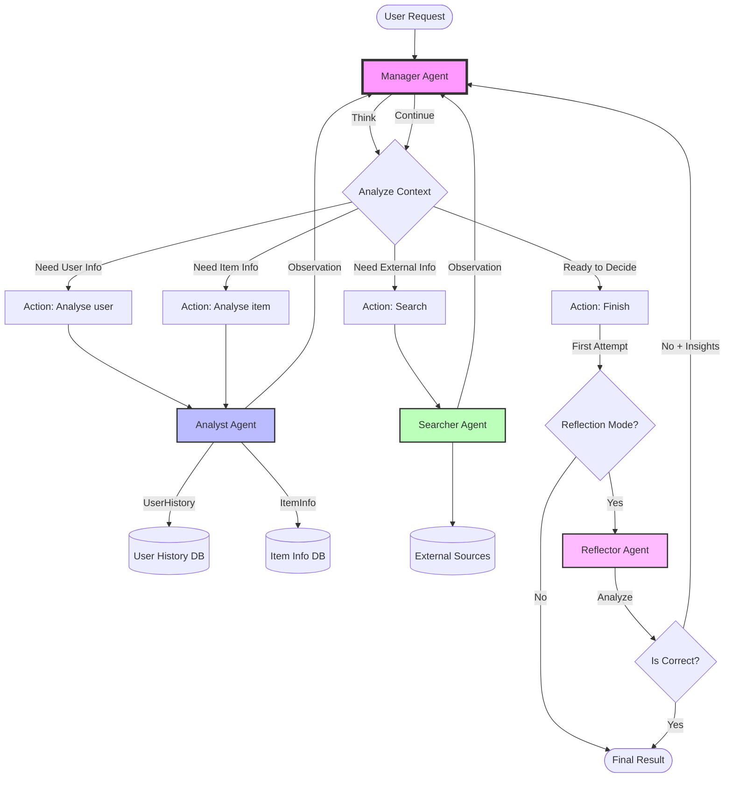
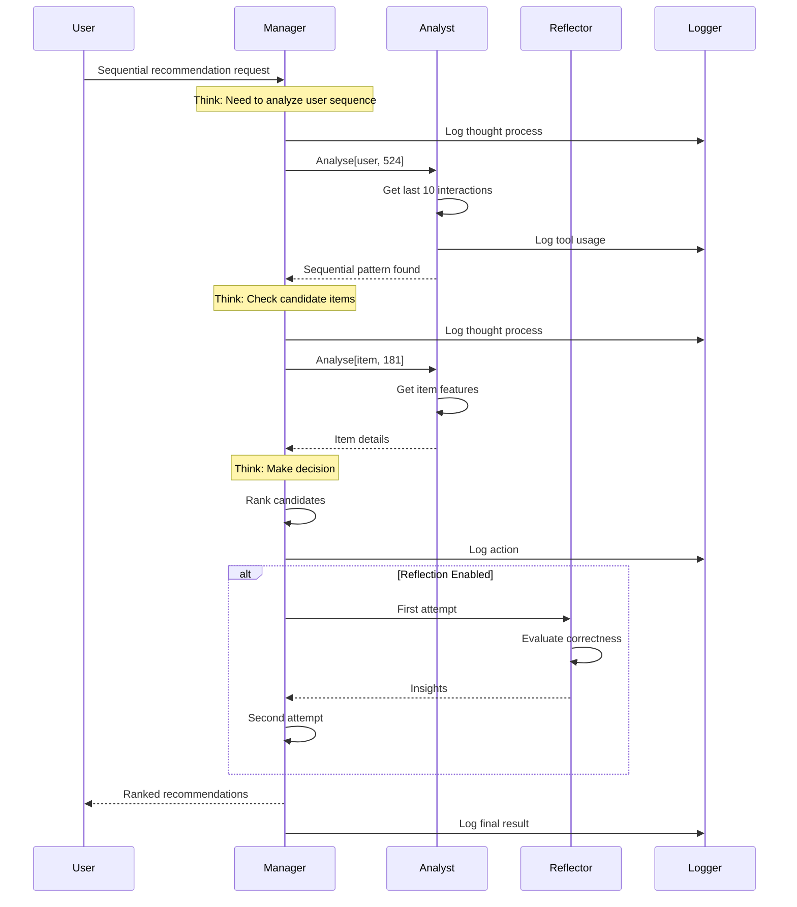

# Agentic Sequential Recommendation System Design Document

## 1. System Overview

This document outlines the design for an advanced agentic recommendation system that combines multi-agent collaboration, sequential recommendation capabilities, and reasoning-based training. The system integrates key innovations from three reference works:

1. **MACRec** (Multi-Agent Collaboration for Recommendation)
   - Paper: `papers/MacRec.pdf`
   - Code: `previousWorks/MACRec/`
   - Analysis: `MACRec_Analysis.md`

2. **LLM-Sequential-Recommendation** (LLM-based Sequential Recommendation)
   - Paper: `papers/Improving Sequential Recommendations with LLMs.pdf`
   - Code: `previousWorks/LLM-Sequential-Recommendation/`
   - Analysis: `LLM_Sequential_Recommendation_Analysis.md`

3. **ThinkRec** (Thinking-based Recommendation Framework)
   - Paper: `papers/thinkRec.pdf`
   - Code: `previousWorks/ThinkRec/`
   - Analysis: `ThinkRec_Technical_Analysis.md`

### 1.1 Core Objectives

- Build a multi-agent system for sequential recommendations using MACRec's agent architecture
- Support two datasets: Delivery Hero and H&M Beauty (same as LLM-Sequential-Recommendation)
- Implement dual-objective training combining recommendation and reasoning tasks (ThinkRec approach)
- Add a reflector component for iterative improvement
- Achieve state-of-the-art performance on sequential recommendation benchmarks

### 1.2 Key Innovations

1. **Agentic Workflow**: Manager-Analyst architecture with specialized agents for different subtasks
   - Reference: `previousWorks/MACRec/macrec/systems/collaboration.py:97-217`
   
2. **Dual Training**: Combining recommendation accuracy (binary classification) with reasoning capability
   - Reference: `previousWorks/ThinkRec/minigpt4/models/minigpt4rec_v2.py:449-535`
   
3. **Reflection-based Learning**: Iterative refinement through self-assessment
   - Reference: `previousWorks/MACRec/macrec/agents/reflector.py:87-105`
   
4. **Sequential Focus**: Optimized for next-item prediction in user sequences
   - Reference: `previousWorks/LLM-Sequential-Recommendation/main/data/session_dataset.py:122-130`

## 2. Dataset Preparation

Following the approach from LLM-Sequential-Recommendation (`papers/Improving Sequential Recommendations with LLMs.pdf`), we prepare two datasets with specific characteristics for sequential recommendation.

### 2.1 Delivery Hero Dataset

**Source**: Proprietary QCommerce dataset  
**Reference Implementation**: `previousWorks/LLM-Sequential-Recommendation/main/data/session_dataset.py`

**Preprocessing Steps** (As specified in `LLM_Sequential_Recommendation_Analysis.md:76-93`):
```python
# No p-core filtering (real-world setting)
# Keep only sessions with >1 interaction
# Maintain temporal ordering
# Anonymous session data structure
```

**Expected Statistics**:
- Sessions: 258,710
- Items: 38,246
- Interactions: 1,474,658
- Average session length: 5.7
- Density: 0.015%

**Key Characteristics**:
- Shorter average sessions than Beauty dataset
- Lower density (sparser data)
- Higher semantic similarity within sessions (items more homogeneous)
- No publicly available product metadata

### 2.2 H&M Beauty Dataset

**Source**: Amazon Beauty 5-core dataset  
**Reference Implementation**: 
- Session Creation: `previousWorks/LLM-Sequential-Recommendation/beauty/create_sessions.ipynb`
- Embedding Attachment: `previousWorks/LLM-Sequential-Recommendation/beauty/attach_embeddings.ipynb`

**Preprocessing Steps** (From `LLM_Sequential_Recommendation_Analysis.md:35-60`):
```python
# Apply 5-core filtering iteratively
MIN_NUM_INTERACTIONS = 5

# Raw data loading
# reviews_Beauty.json - user reviews
# meta_Beauty.json - product metadata

# Extract product names from metadata
# Clean HTML entities (e.g., &amp; → "and")
# Map product names to item IDs
```

**Expected Statistics**:
- Sessions: 22,363
- Items: 12,101
- Interactions: 198,502
- Average session length: 8.9
- Density: 0.073%

### 2.3 Data Format

**Session Structure** (From `LLM_Sequential_Recommendation_Analysis.md:66-75`):
```json
{
  "SessionId": 0,  // mapped from reviewer ID
  "ItemId": 1234,  // mapped from ASIN
  "Time": "2023-01-15 10:30:00",
  "Product": "Bio-Active Anti-Aging Serum",
  "Reward": 1.0  // implicit feedback
}
```

**Processed Format for Training** (From `LLM_Sequential_Recommendation_Analysis.md:431-445`):
```python
{
    'user_id': 524,
    'item_id': 181,
    'rating': 4.0,
    'user_profile': 'Age: 25\nGender: male\nOccupation: technician',
    'target_item_attributes': 'Title: Toy Story, Genres: Animation|Children|Comedy',
    'history': 'Title: Star Wars, Genres: Action|Adventure|Sci-Fi (rating: 5)\nTitle: ...',
    'candidate_item_id': [181, 95, 234, 567, ...],  # target + negatives
    'candidate_item_attributes': '181: Title: Toy Story, Genres: Animation|Children|Comedy\n95: ...'
}
```

### 2.4 Sequential Task Formulation

**Leave-one-out Evaluation** (From `LLM_Sequential_Recommendation_Analysis.md:117-130`):
```python
# From previousWorks/LLM-Sequential-Recommendation/main/data/session_dataset.py
def _prepare_to_predict(self, data, n_withheld=1):
    prompt_items = session_items[:-n_withheld]
    return prompt_items

def _extract_ground_truths(self, data, n_withheld=1):
    ground_truth = session_items[-n_withheld:]
    return ground_truth
```

**Negative Sampling Strategy** (From `LLM_Sequential_Recommendation_Analysis.md:519-533`):
```python
# From previousWorks/LLM-Sequential-Recommendation/main/data/session_dataset.py:162-168
def negative_sample(df, n_neg_items=9):  # Default n_neg_items=9
    neg_items = np.random.randint(1, n_items + 1, (len(df), n_neg_items))
    for i, uid in enumerate(df['user_id'].values):
        user_clicked = clicked_item_set[uid]  # Items user has already interacted with
        for j in range(len(neg_items[i])):
            # Ensure negatives are: 1) Not clicked by user, 2) Not duplicates
            while neg_items[i][j] in user_clicked or neg_items[i][j] in neg_items[i][:j]:
                neg_items[i][j] = np.random.randint(1, n_items + 1)
    df['neg_item_id'] = neg_items.tolist()
    return df

# Create candidate pool: target item + negative samples
# From previousWorks/LLM-Sequential-Recommendation/main/dataset/ml100k.py:162
df['candidate_item_id'] = df.apply(lambda x: [x['item_id']] + x['neg_item_id'], axis=1)
# Shuffle to avoid positional bias
df['candidate_item_id'] = df['candidate_item_id'].apply(lambda x: shuffle_list(x))
```

## 3. Agent Architecture

Based on MACRec's design (`papers/MacRec.pdf`, `previousWorks/MACRec/`), we implement a multi-agent system with specialized roles.

### 3.1 Manager Agent

**Reference**: `previousWorks/MACRec/macrec/agents/manager.py`

**Responsibilities**:
- Central orchestration of the recommendation process
- Two-stage LLM architecture (thought + action)
- Token limit management
- Agent coordination

#### 3.1.1 Think vs Action Mechanism

**When Manager Thinks**:
The Manager enters the "thinking" phase when it needs to:
1. **Analyze the current situation** - Understanding what information has been gathered
2. **Plan next steps** - Deciding which agent to call or whether to finish
3. **Synthesize observations** - Processing responses from other agents

**When Manager Acts**:
The Manager enters the "action" phase when it needs to:
1. **Execute a decision** - Calling an agent with specific parameters
2. **Return final results** - Using Finish[response] action
3. **Structure output** - Ensuring proper JSON/text formatting

**The ReAct Pattern** (Reasoning + Acting):
```
Thought 1: I need to understand user preferences for sequential recommendation
Action 1: Analyse[user, 524]
Observation 1: User likes action movies, recently watched sci-fi series

Thought 2: Based on user's sequential pattern, I should check item details
Action 2: Analyse[item, 181]
Observation 2: Item is "Toy Story" - Animation/Children/Comedy

Thought 3: The item doesn't match user's action/sci-fi preference pattern
Action 3: Finish[No]
```

**Implementation** (From `MACRec_Analysis.md:28-52`):
```python
# From previousWorks/MACRec/macrec/agents/manager.py:14-33, 76-85
class Manager(Agent):
    def __init__(self, thought_config_path: str, action_config_path: str, *args, **kwargs):
        super().__init__(*args, **kwargs)
        # Two separate LLMs with potentially different configurations
        self.thought_llm = self.get_LLM(thought_config_path)  # Optimized for reasoning
        self.action_llm = self.get_LLM(action_config_path)    # Optimized for structured output
        self.json_mode = self.action_llm.json_mode
        
    def _prompt_thought(self, **kwargs) -> str:
        # Uses scratchpad history to maintain context
        thought_prompt = self._build_manager_prompt(**kwargs)
        thought_response = self.thought_llm(thought_prompt)  # Free-form reasoning
        return format_step(thought_response)
        
    def _prompt_action(self, **kwargs) -> str:
        # Uses same context but expects structured output
        action_prompt = self._build_manager_prompt(**kwargs)
        action_response = self.action_llm(action_prompt)    # Structured action
        return format_step(action_response)
        
    def forward(self, stage: str, *args, **kwargs) -> str:
        if stage == 'thought':
            return self._prompt_thought(**kwargs)
        elif stage == 'action':
            return self._prompt_action(**kwargs)
```

**Why Two Separate LLMs?**:
1. **Specialization**: Thought LLM can be more creative/analytical, Action LLM more structured
2. **Token Efficiency**: Action LLM can be smaller, focused on parsing
3. **Error Reduction**: Structured actions less prone to formatting errors
4. **Fine-tuning**: Each LLM can be optimized for its specific task

**Available Actions** (From `MACRec_Analysis.md:68-77`):
```
(1) Analyse[user/item, id] - ask Analyst to analyze preferences/features
(2) Search[requirements] - ask Searcher to find information  
(3) Interpret[content] - ask Task Interpreter to summarize content
(4) Finish[response] - finish task and return response
```

**Location**: `previousWorks/MACRec/macrec/agents/manager.py:10-94`

### 3.2 Analyst Agent

**Reference**: `previousWorks/MACRec/macrec/agents/analyst.py`

**Responsibilities**:
- Analyze user preferences from historical sequences
- Extract item features and patterns
- Provide insights to Manager

**Tools**:
```python
# Commands available to Analyst
"UserHistory[id, k]"     # Get user's k most recent interactions
"ItemInfo[id]"           # Get item attributes
"SequenceAnalysis[seq]"  # Analyze sequential patterns
"Finish[analysis]"       # Return analysis results
```

### 3.3 Reflector Agent

**Reference**: `previousWorks/MACRec/macrec/agents/reflector.py`

**Responsibilities**:
- Improve recommendations through iterative refinement
- Self-assessment of prediction quality
- Generate reflection-based training data

#### 3.3.1 Basic Mode of Operation

**The Reflection Loop**:
```
1. Initial Attempt → 2. Reflection → 3. Improved Attempt → 4. Reward Calculation
```

**How Reflector Works**:
1. **Receives Failed Attempt**: Gets the scratchpad (thought-action-observation history)
2. **Analyzes Failure**: Identifies why the recommendation was incorrect
3. **Provides Guidance**: Generates insights for improvement
4. **Enables Retry**: System uses reflection to make better attempt

**Reflection Strategies** (From `MACRec_Analysis.md:118-125`):
```python
# From previousWorks/MACRec/macrec/agents/reflector.py:11-18
class ReflectionStrategy(Enum):
    NONE = 'base'                                    # No reflection
    LAST_ATTEMPT = 'last_trial'                     # Store previous attempt
    REFLEXION = 'reflection'                        # LLM-based analysis  
    LAST_ATTEMPT_AND_REFLEXION = 'last_trial_and_reflection'  # Combined
```

**Basic Mode Implementation**:
```python
# Simplified reflection flow
def reflect_and_retry(self, task, first_attempt):
    # Step 1: Reflect on the attempt
    reflection = self.reflector.forward(
        input=task,
        scratchpad=first_attempt['history'],
        reflection_strategy=ReflectionStrategy.REFLEXION
    )
    
    # Step 2: Extract insights (JSON mode)
    insights = json.loads(reflection)
    # Example: {"correctness": false, 
    #           "reason": "Failed to consider user's recent preference shift"}
    
    # Step 3: Update context with reflection
    enhanced_context = f"""
    Previous attempt failed. Reflection:
    {insights['reason']}
    
    Now trying again with this insight in mind.
    """
    
    # Step 4: Retry with enhanced context
    second_attempt = self.manager.forward(
        task=task,
        additional_context=enhanced_context
    )
    
    return second_attempt, insights
```

**Implementation Details** (From `MACRec_Analysis.md:127-149`):
```python
# From previousWorks/MACRec/macrec/agents/reflector.py:87-105
def forward(self, input: str, scratchpad: str, *args, **kwargs) -> str:
    if self.reflection_strategy == ReflectionStrategy.LAST_ATTEMPT:
        # Simply stores the last attempt as context
        self.reflections = [scratchpad]
        self.reflections_str = format_last_attempt(input, scratchpad, 
                                                 self.prompts['last_trial_header'])
        
    elif self.reflection_strategy == ReflectionStrategy.REFLEXION:
        # Uses LLM to analyze and improve
        self.reflections.append(self._prompt_reflection(input=input, scratchpad=scratchpad))
        self.reflections_str = format_reflections(self.reflections, 
                                                header=self.prompts['reflection_header'])
        
    elif self.reflection_strategy == ReflectionStrategy.LAST_ATTEMPT_AND_REFLEXION:
        # Combines both approaches
        self.reflections_str = format_last_attempt(input, scratchpad, 
                                                 self.prompts['last_trial_header'])
        self.reflections = self._prompt_reflection(input=input, scratchpad=scratchpad)
        self.reflections_str += format_reflections(self.reflections, 
                                                  header=self.prompts['reflection_last_trial_header'])
```

**Reflection Output Examples**:
```json
// Success case
{"correctness": true, "reason": "The recommendation correctly identified the user's preference for sci-fi movies based on recent viewing history."}

// Failure case  
{"correctness": false, "reason": "The model focused on genre popularity rather than the user's specific sequential pattern of watching darker, mature content."}
```

**Location**: `previousWorks/MACRec/macrec/agents/reflector.py:20-106`

### 3.4 Communication Protocol

**Inter-agent Communication** (Reference: `previousWorks/MACRec/macrec/systems/collaboration.py`):
```python
def execute(self, action_type: str, argument: Any):
    if action_type.lower() == 'analyse':
        observation = self.analyst.invoke(argument, json_mode=True)
    elif action_type.lower() == 'reflect':
        observation = self.reflector.invoke(argument)
    
    # Log communication for debugging
    self.log(f'Calling {action_type} with {argument}')
    self.log(f'Response: {observation}')
```

## 3.5 MACRec System Flow Chart

### 3.5.1 Overall Recommendation Flow



### 3.5.2 Sequential Recommendation Flow



## 3.6 Logging System Architecture

### 3.6.1 System-Wide Logging Mechanism

**Core Implementation** (From `MACRec_Analysis.md:300-324`):
```python
# From previousWorks/MACRec/macrec/systems/base.py:93-114
def log(self, message: str, agent: Optional[Agent] = None, logging: bool = True) -> None:
    if logging:
        logger.debug(message)  # Standard logging
        
    if self.web_demo:
        if agent is None:
            role = 'Assistant'
        else:
            role = agent.__class__.__name__  # Get agent type (Manager, Analyst, etc.)
            
        # Format message with agent identity and color coding
        final_message = f'{get_avatar(role)}:{get_color(role)}[**{role}**]: {message}'
        
        # Special formatting for non-manager agents (indentation)
        if 'manager' not in role.lower() and 'assistant' not in role.lower():
            messages = final_message.split('\n')
            messages = [f'- {messages[0]}'] + [f'  {message}' for message in messages[1:]]'
            final_message = '\n'.join(messages)
            
        self.web_log.append(final_message)
        st.markdown(f'{final_message}')  # Display in web interface
```

### 3.6.2 Logging Components

**1. Agent-Specific Logging**:
```python
# Manager logs thoughts and actions
self.log(f'**Thought {self.step_n}**: {thought}', agent=self.manager)
self.log(f'**Action {self.step_n}**: {action}', agent=self.manager)

# Analyst logs tool usage
self.log(f':violet[Look up UserHistory of user] :red[{user_id}]', agent=self.analyst)

# Reflector logs reflections
self.log(f'[:violet[Reflection]]: {reflection}', agent=self.reflector)
```

**2. Communication Logging**:
```python
# Log inter-agent calls
self.log(f':violet[Calling] :red[{agent_name}] :violet[with] :blue[{argument}]', 
         agent=self.manager)

# Log responses
self.log(f':violet[Response from] :red[{agent_name}]: {observation}', 
         agent=self.manager)
```

**3. Performance Logging**:
```python
class PerformanceLogger:
    def __init__(self):
        self.metrics = {
            'think_times': [],
            'action_times': [],
            'agent_call_times': defaultdict(list),
            'total_tokens': 0
        }
    
    def log_timing(self, operation: str, duration: float):
        self.metrics[f'{operation}_times'].append(duration)
    
    def log_tokens(self, count: int):
        self.metrics['total_tokens'] += count
```

### 3.6.3 Structured Logging Format

**Log Entry Structure**:
```json
{
    "timestamp": "2024-01-15T10:30:45.123Z",
    "session_id": "rec_session_12345",
    "agent": "Manager",
    "type": "thought|action|observation|error",
    "step_number": 3,
    "content": {
        "message": "Analyzing user sequential pattern",
        "context": {
            "user_id": 524,
            "session_length": 10,
            "current_candidates": 100
        }
    },
    "performance": {
        "duration_ms": 234,
        "tokens_used": 156
    }
}
```

### 3.6.4 Implementation for Debugging

```python
class AgenticLogger:
    def __init__(self, config):
        self.file_handler = self._setup_file_logging(config['log_dir'])
        self.console_handler = self._setup_console_logging()
        self.web_handler = self._setup_web_logging() if config['web_demo'] else None
        
    def log_agent_action(self, agent_name: str, action_type: str, 
                        content: dict, metadata: dict = None):
        log_entry = {
            'timestamp': datetime.now().isoformat(),
            'agent': agent_name,
            'action_type': action_type,
            'content': content,
            'metadata': metadata or {}
        }
        
        # Log to file for debugging
        self.file_handler.info(json.dumps(log_entry))
        
        # Log to console with formatting
        self._console_format(log_entry)
        
        # Log to web interface if enabled
        if self.web_handler:
            self._web_format(log_entry)
    
    def _console_format(self, entry):
        # Color-coded console output
        colors = {
            'Manager': '\033[95m',     # Purple
            'Analyst': '\033[94m',     # Blue
            'Reflector': '\033[93m',   # Yellow
            'Searcher': '\033[92m'     # Green
        }
        color = colors.get(entry['agent'], '\033[0m')
        print(f"{color}[{entry['agent']}] {entry['content']['message']}\033[0m")
```

## 4. Training Strategy

Inspired by ThinkRec's dual-objective approach (`papers/thinkRec.pdf`, `previousWorks/ThinkRec/`), we implement a sophisticated training pipeline.

### 4.1 Dual-Objective Training

**Objective 1: Recommendation Task (L_rec)**
- **Type**: Binary classification (Yes/No for item recommendation)
- **Reference**: `previousWorks/ThinkRec/minigpt4/models/minigpt4rec_v2.py:474-535`

```python
def recommendation_loss(logits, labels):
    # Extract logit for "Yes" token
    yes_token_logit = logits[:, -1, yes_token_id]
    # Binary cross-entropy loss
    loss = F.binary_cross_entropy_with_logits(yes_token_logit, labels.float())
    return loss
```

**Objective 2: Reasoning Task (L_think)**
- **Type**: Language modeling on reasoning sequences
- **Reference**: `previousWorks/ThinkRec/minigpt4/models/minigpt4rec_v2.py:787-854`

```python
def reasoning_loss(outputs, reasoning_targets):
    # Standard cross-entropy over reasoning tokens
    # Mask prompt tokens, only compute loss on reasoning
    return outputs.loss
```

**Combined Loss**:
```python
loss = α * L_rec + β * L_think
# α = 0.1, β = 0.9 (emphasize reasoning)
```

### 4.2 Training Data Generation

**Step 1: Collect Wrong Predictions**
```python
# Identify cases where model fails
wrong_predictions = []
for session in validation_set:
    prediction = model.predict(session[:-1])
    if prediction != session[-1]:
        wrong_predictions.append(session)
```

**Step 2: Generate Reasoning Data**
- Use a powerful model (e.g., GPT-4) to analyze wrong predictions
- Generate explanations for correct recommendations
- Create reasoning training data

**Step 3: Reflection-based Data**
```python
# Generate two attempts for each sample
attempt_1 = model.predict(sample)
reflection = reflector.reflect(attempt_1, ground_truth)
attempt_2 = model.predict(sample, reflection=reflection)

# Calculate improvement reward
reward = reward_function(attempt_1, attempt_2, ground_truth)
```

### 4.3 Training Pipeline

**Phase 1: Supervised Pre-training**
```python
# Train on recommendation task with standard data
for batch in train_loader:
    loss = model.forward_recommendation(batch)
    optimizer.step()
```

**Phase 2: Reasoning Integration**
```python
# Mixed training with both objectives
for epoch in range(num_epochs):
    for batch in mixed_dataloader:
        if batch.type == "recommendation":
            loss = α * model.forward_recommendation(batch)
        else:  # reasoning
            loss = β * model.forward_reasoning(batch)
        optimizer.step()
```

**Phase 3: Reflection Fine-tuning**
```python
# Use reflection rewards for RLHF-style training
for batch in reflection_dataloader:
    loss = ppo_loss(batch.attempts, batch.rewards)
    optimizer.step()
```

## 5. Evaluation Metrics

Following LLM-Sequential-Recommendation's evaluation setup (`LLM_Sequential_Recommendation_Analysis.md`).

### 5.1 Core Metrics

**Hit Rate@K** (From `LLM_Sequential_Recommendation_Analysis.md:244-246`):
```python
def hit_rate_at_k(predictions, ground_truth, k):
    return 1.0 if any(item in ground_truth for item in predictions[:k]) else 0.0
```

**NDCG@K** (From `LLM_Sequential_Recommendation_Analysis.md:237-242`):
```python
def ndcg_at_k(predictions, ground_truth, k):
    dcg = sum([1/log2(i+2) for i, item in enumerate(predictions[:k]) 
               if item in ground_truth])
    idcg = sum([1/log2(i+2) for i in range(min(len(ground_truth), k))])
    return dcg / idcg if idcg > 0 else 0
```

**MRR (Mean Reciprocal Rank)**:
```python
def mrr(predictions, ground_truth):
    if ground_truth in predictions:
        position = predictions.index(ground_truth)
        return 1.0 / (position + 1)
    return 0.0
```

### 5.2 Evaluation Protocol

**Leave-one-out Setup** (From `LLM_Sequential_Recommendation_Analysis.md:117-130`):
- **Training**: Items 1 to n-2 from session
- **Validation**: Item n-1
- **Test**: Item n

**Candidate Pool Generation** (From `LLM_Sequential_Recommendation_Analysis.md:505-516`):
```python
# From previousWorks/LLM-Sequential-Recommendation/main/dataset/ml100k.py:162, 168
# 1. Create candidate pool: target item + negative samples
df['candidate_item_id'] = df.apply(lambda x: [x['item_id']] + x['neg_item_id'], axis=1)

# 2. Shuffle the order to avoid positional bias
def shuffle_list(x):
    random.shuffle(x)
    return x

df['candidate_item_id'] = df['candidate_item_id'].apply(lambda x: shuffle_list(x))
```

**Metrics Computation**:
1. **Target item + 99 random negatives** (total 100 candidates)
2. **Model ranks all 100 items**
3. **Compute HR@10, NDCG@10, MRR**

### 5.3 Top-K Selection Methods

**Neural Models** (From `LLM_Sequential_Recommendation_Analysis.md:200-207`):
```python
# From previousWorks/LLM-Sequential-Recommendation/main/transformer/sasrec/sasrec_model.py
def predict(self, predict_data, top_k=10):
    scores = model.forward(session_items)  # Get scores for all items
    top_k_indices = scores.argsort()[-top_k:][::-1]  # Sort and take top-k
    return catalog_items[top_k_indices]
```

**LLM Generation Approach** (From `LLM_Sequential_Recommendation_Analysis.md:219-230`):
```python
# From previousWorks/LLM-Sequential-Recommendation/main/llm_based/prompt_model/genitem/predict_gpt.ipynb
# For single item generation:
recommendations = []
for i in range(k):
    item = llm.generate(prompt, temperature=0.7)
    recommendations.append(item)

# Deduplicate and rank by frequency
ranked_recs = Counter(recommendations).most_common(k)
```

### 5.4 Expected Performance Targets

Based on reference implementations:

**Delivery Hero Dataset**:
- **HR@10**: 0.15-0.20
- **NDCG@10**: 0.08-0.12
- **MRR**: 0.10-0.15

**H&M Beauty Dataset**:
- **HR@10**: 0.25-0.30
- **NDCG@10**: 0.15-0.20
- **MRR**: 0.18-0.25

## 6. Implementation Roadmap (Updated Approach)

### 6.1 Phase 1: Dataset Preparation & Unit Testing (Week 1)

**Objective**: Build and verify dataset processing pipeline

**Tasks**:
1. Implement data loaders for Delivery Hero and Beauty datasets
2. Create negative sampling strategies
3. Build leave-one-out evaluation splits
4. Unit test all data processing functions

**Key Components**:
```python
# datasets/base_dataset.py
class SequentialDataset:
    def __init__(self, data_path, n_neg_items=99):
        self.data = self._load_data(data_path)
        self.process_sessions()
        self.create_splits()
    
    def test_data_integrity(self):
        # Verify no data leakage
        # Check negative sampling correctness
        # Validate sequence lengths
        pass

# tests/test_datasets.py
def test_negative_sampling():
    # Ensure negatives not in user history
    # Verify candidate pool size = 100
    # Check shuffle randomness
    pass

def test_metrics():
    # Test HR@K calculation
    # Test NDCG@K calculation  
    # Verify metric bounds
    pass
```

**Verification**:
- Run metrics on dummy predictions
- Compare with reference implementation results
- Validate data statistics match expected values

### 6.2 Phase 2: Agent Flow with Gemini API (Week 2-3)

**Objective**: Build working agent system using Gemini 2.5 Flash

**Gemini Integration**:
```python
# agents/llm_provider.py
import google.generativeai as genai

class GeminiProvider:
    def __init__(self, api_key="******"):
        genai.configure(api_key=api_key)
        self.model = genai.GenerativeModel('gemini-2.0-flash-exp')
        
    def generate(self, prompt: str, temperature: float = 0.7):
        response = self.model.generate_content(
            prompt,
            generation_config=genai.types.GenerationConfig(
                temperature=temperature,
                top_p=0.9,
                max_output_tokens=512,
            )
        )
        return response.text
```

**Agent Implementation**:
```python
# agents/manager.py
class Manager:
    def __init__(self, llm_provider):
        self.thought_llm = llm_provider  # Use same provider for both initially
        self.action_llm = llm_provider   # Can separate later
        self.scratchpad = ""
        
    def think(self, context):
        prompt = f"""
        You are a recommendation system manager. 
        Current context: {context}
        Scratchpad: {self.scratchpad}
        
        What should we analyze next? Think step by step.
        """
        thought = self.thought_llm.generate(prompt, temperature=0.8)
        self.scratchpad += f"\nThought: {thought}"
        return thought
        
    def act(self):
        prompt = f"""
        Based on your thoughts, choose an action:
        - Analyse[user/item, id]
        - Search[query]  
        - Finish[result]
        
        Scratchpad: {self.scratchpad}
        
        Return only the action in the exact format.
        """
        action = self.action_llm.generate(prompt, temperature=0.3)
        self.scratchpad += f"\nAction: {action}"
        return self._parse_action(action)
```

**Testing Different Modes**:
```python
# tests/test_agent_flow.py
def test_basic_flow():
    # Test think -> act -> observe cycle
    pass

def test_reflection_mode():
    # Test with reflection enabled
    # Verify second attempt improves
    pass

def test_multi_turn_conversation():
    # Test complex multi-step reasoning
    pass
```

### 6.3 Phase 3: Integration Testing (Week 4)

**Objective**: Ensure complete system works end-to-end

**Integration Tests**:
```python
# tests/test_integration.py
class TestEndToEnd:
    def test_sequential_recommendation(self):
        # Load sample session
        session = load_test_session()
        
        # Run through agent system
        recommender = AgenticRecommender()
        results = recommender.recommend(session['history'][:-1])
        
        # Verify results format
        assert len(results) == 100
        assert session['history'][-1] in results
        
        # Check metrics
        hr_10 = hit_rate_at_k(results, session['history'][-1], k=10)
        assert hr_10 in [0.0, 1.0]
    
    def test_with_reflection(self):
        # Enable reflection
        recommender = AgenticRecommender(reflection_mode=True)
        
        # Verify two attempts made
        # Check reflection improves results
        pass
    
    def test_logging_system(self):
        # Verify all agent actions logged
        # Check log format consistency
        # Ensure performance metrics tracked
        pass
```

**Performance Benchmarks**:
```python
def benchmark_inference_speed():
    # Target: <500ms per recommendation
    # Measure with/without reflection
    # Test batch processing
    pass
```

### 6.4 Phase 4: Training Implementation (Week 5-6)

**Objective**: Implement training pipeline (ready for execution)

**Training Components**:
```python
# training/dual_objective.py
class DualObjectiveTrainer:
    def __init__(self, model, config):
        self.model = model
        self.alpha = config['alpha']  # Rec weight
        self.beta = config['beta']    # Reasoning weight
        
    def prepare_for_training(self):
        # Switch from Gemini to trainable model
        # Initialize LoRA adapters
        # Set up optimizers
        pass
    
    def train_step(self, batch):
        if batch['type'] == 'recommendation':
            loss = self.alpha * self.rec_loss(batch)
        else:
            loss = self.beta * self.reasoning_loss(batch)
        return loss
```

**Data Generation Scripts**:
```python
# scripts/generate_reasoning_data.py
def generate_reasoning_data():
    # Use Gemini to generate reasoning
    # Save in training format
    # Validate data quality
    pass

# scripts/generate_reflection_data.py  
def generate_reflection_data():
    # Run model twice per sample
    # Calculate rewards
    # Format for RLHF training
    pass
```

### 6.5 Key Milestones & Deliverables

**Week 1**: Dataset pipeline complete, metrics verified
**Week 2-3**: Agent system working with Gemini API
**Week 4**: Full integration tests passing
**Week 5-6**: Training code ready (not executed)

**Success Criteria**:
1. ✅ Datasets load correctly with expected statistics
2. ✅ Agents communicate properly using Gemini
3. ✅ Reflection mode shows improvement
4. ✅ Logging captures all interactions
5. ✅ Integration tests cover all flows
6. ✅ Training code ready for GPU execution

## 7. Technical Considerations

### 7.1 Model Selection

**Base LLM Options**:
- Llama-3-8B (recommended for reasoning capability)
- Vicuna-7B (lighter alternative)
- GPT-3.5-turbo (API-based option)

### 7.2 Computational Requirements

**Training**:
- GPU: 2-4 A100 (80GB) for full training
- RAM: 128GB minimum
- Storage: 500GB for datasets and checkpoints

**Inference**:
- GPU: 1 A100 or 2 V100s
- Batch inference for efficiency

### 7.3 Key Hyperparameters

```yaml
# Training configuration
learning_rate: 1e-5
batch_size: 16
num_epochs: 10
warmup_steps: 1000

# Loss weights
alpha: 0.1  # Recommendation task
beta: 0.9   # Reasoning task

# Agent configuration
max_turns: 5
temperature: 0.7
top_p: 0.9

# Reflection
reflection_strategy: "last_trial_and_reflection"
reflection_temperature: 1.0
```

## 8. Expected Outcomes

### 8.1 Performance Targets

Based on reference implementations:
- **HR@10**: 0.15-0.20 (Delivery Hero), 0.25-0.30 (Beauty)
- **NDCG@10**: 0.08-0.12 (Delivery Hero), 0.15-0.20 (Beauty)
- **Inference Time**: <500ms per recommendation

### 8.2 Qualitative Improvements

1. **Interpretability**: Agent conversations provide reasoning traces
2. **Adaptability**: Reflection allows online improvement
3. **Generalization**: Reasoning helps with cold-start items

## 9. References

### Papers
1. **MACRec**: `papers/MacRec.pdf`
2. **LLM-Sequential**: `papers/Improving Sequential Recommendations with LLMs.pdf`
3. **ThinkRec**: `papers/thinkRec.pdf`

### Code References
1. **MACRec Implementation**: `previousWorks/MACRec/`
2. **LLM-Sequential Implementation**: `previousWorks/LLM-Sequential-Recommendation/`
3. **ThinkRec Implementation**: `previousWorks/ThinkRec/`

### Analysis Documents
1. **MACRec Analysis**: `MACRec_Analysis.md`
2. **LLM-Sequential Analysis**: `LLM_Sequential_Recommendation_Analysis.md`
3. **ThinkRec Analysis**: `ThinkRec_Technical_Analysis.md`

## 10. Appendix: Code Examples

### A. Complete Agent Workflow Example

```python
# Based on MACRec workflow (MACRec_Analysis.md:243-260)
class AgenticSequentialRecommender:
    def recommend(self, session_data):
        # Step 1: Manager thinks about the task
        thought = self.manager.think(
            f"User has interacted with {len(session_data['history'])} items in sequence..."
        )
        self.log(f'Thought: {thought}')
        
        # Step 2: Manager decides action
        action_type, argument = self.manager.act()
        # e.g., Returns: ("Analyse", ["user", session_data['user_id']])
        
        # Step 3: Execute action with appropriate agent
        if action_type.lower() == 'analyse':
            # Analyst examines user sequential patterns
            analysis = self.analyst.invoke({
                "user_id": session_data['user_id'],
                "sequence": session_data['history'][-10:],  # Last 10 items
                "command": "UserHistory"
            })
            
        # Step 4: Manager processes analysis and makes recommendation
        thought = self.manager.think(f"Based on sequential pattern analysis: {analysis}")
        action = self.manager.act()  # Returns: Finish[item_rankings]
        
        return action['rankings']
```

### B. Dual-Objective Training Loop

```python
# Based on ThinkRec training (ThinkRec_Technical_Analysis.md:90-103)
def train_dual_objective(model, train_loader, config):
    alpha = config['loss_config']['alpha']  # 0.1 for recommendation
    beta = config['loss_config']['beta']    # 0.9 for reasoning
    
    for epoch in range(config['num_epochs']):
        for batch_idx, batch in enumerate(train_loader):
            # Sample task type based on ratios
            if random.random() < 0.8:  # 80% recommendation tasks
                model.set_mode('v2')
                outputs = model.forward(batch)
                loss = alpha * outputs['loss']
            else:  # 20% reasoning tasks
                model.set_mode('v1')
                outputs = model.forward(batch)
                loss = beta * outputs['loss']
            
            optimizer.zero_grad()
            loss.backward()
            optimizer.step()
            
            # Log progress
            if batch_idx % 100 == 0:
                print(f"Epoch {epoch}, Batch {batch_idx}, Loss: {loss.item():.4f}")
```

### C. Sequential Data Processing Pipeline

```python
# Based on LLM-Sequential-Recommendation (LLM_Sequential_Recommendation_Analysis.md:519-547)
def prepare_sequential_data(sessions_df, n_neg_items=99):
    processed_data = []
    
    for _, session in sessions_df.iterrows():
        # Leave-one-out split
        items = session['item_sequence']
        prompt_items = items[:-1]
        target_item = items[-1]
        
        # Generate negative samples
        user_clicked = set(items)
        neg_items = []
        while len(neg_items) < n_neg_items:
            candidate = random.randint(1, num_items)
            if candidate not in user_clicked and candidate not in neg_items:
                neg_items.append(candidate)
        
        # Create candidate pool and shuffle
        candidates = [target_item] + neg_items
        random.shuffle(candidates)
        
        # Format for training
        processed_data.append({
            'session_id': session['session_id'],
            'prompt_items': prompt_items,
            'prompt_names': [item_id_to_name[i] for i in prompt_items],
            'candidates': candidates,
            'candidate_names': [item_id_to_name[i] for i in candidates],
            'target_idx': candidates.index(target_item),
            'target_item': target_item
        })
    
    return processed_data
```

### D. Reflection-based Improvement

```python
# Based on MACRec reflection (MACRec_Analysis.md:856-878)
def generate_reflection_data(model, validation_data):
    reflection_samples = []
    
    for sample in validation_data:
        # First attempt
        model.set_reflection_strategy('base')
        attempt_1 = model.predict(sample['prompt_items'])
        
        # Reflection on first attempt
        reflection_prompt = f"""The model predicted {attempt_1} but the correct answer 
        was {sample['target_item']}. Analyze why this prediction might be wrong 
        considering the user's sequential pattern: {sample['prompt_names']}"""
        
        reflection = model.reflector.reflect(reflection_prompt)
        
        # Second attempt with reflection
        model.set_reflection_strategy('last_trial_and_reflection')
        model.set_reflection_context(reflection)
        attempt_2 = model.predict(sample['prompt_items'])
        
        # Calculate reward for RLHF
        reward = calculate_improvement_reward(
            attempt_1, attempt_2, sample['target_item']
        )
        
        reflection_samples.append({
            'input': sample,
            'attempt_1': attempt_1,
            'attempt_2': attempt_2,
            'reflection': reflection,
            'reward': reward
        })
    
    return reflection_samples
```

### E. Embedding Integration Example

```python
# Based on ThinkRec embedding approach (ThinkRec_Technical_Analysis.md:269-333)
class EmbeddingIntegratedRecommender:
    def __init__(self, rec_encoder, llm_model, projection_layer):
        self.rec_encoder = rec_encoder  # Collaborative filtering model
        self.llm_model = llm_model      # Language model
        self.projection = projection_layer  # Project CF embeddings to LLM space
    
    def prepare_input(self, user_id, item_sequence, target_item_id):
        # Get collaborative embeddings
        all_user_embeds, all_item_embeds = self.rec_encoder.compute()
        
        # Get user embedding based on sequence
        if self.rec_model_type == "sasrec":
            user_embed = self.rec_encoder.seq_encoder(item_sequence)
        else:
            user_embed = self.rec_encoder.user_encoder(user_id, all_user_embeds)
        
        # Get target item embedding
        target_embed = self.rec_encoder.item_encoder(target_item_id, all_item_embeds)
        
        # Project to LLM space
        user_embed_llm = self.projection(user_embed)
        target_embed_llm = self.projection(target_embed)
        
        # Create prompt with placeholder tokens
        prompt = "A user with feature <UserID> would enjoy item <TargetItemID>?"
        
        # Replace placeholders with embeddings
        prompt_tokens = self.tokenizer(prompt)
        prompt_embeds = self.llm_model.embed_tokens(prompt_tokens)
        
        # Find <UserID> and <TargetItemID> positions and replace
        user_pos = find_token_position(prompt_tokens, "<UserID>")
        item_pos = find_token_position(prompt_tokens, "<TargetItemID>")
        
        prompt_embeds[user_pos] = user_embed_llm
        prompt_embeds[item_pos] = target_embed_llm
        
        return prompt_embeds
```

### F. Complete Training Script

```python
# Combining all components
if __name__ == "__main__":
    # Load configuration
    config = load_config("configs/agentic_sequential_rec.yaml")
    
    # Initialize datasets
    beauty_data = prepare_beauty_dataset(config['data']['beauty_path'])
    delivery_data = prepare_delivery_dataset(config['data']['delivery_path'])
    
    # Initialize agents
    manager = Manager(
        thought_config=config['agents']['manager']['thought'],
        action_config=config['agents']['manager']['action']
    )
    analyst = Analyst(config['agents']['analyst'])
    reflector = Reflector(config['agents']['reflector'])
    
    # Initialize model with agents
    model = AgenticSequentialModel(
        manager=manager,
        analyst=analyst,
        reflector=reflector,
        config=config['model']
    )
    
    # Training phases
    print("Phase 1: Supervised Pre-training")
    pretrain(model, beauty_data['train'], config['pretrain'])
    
    print("Phase 2: Dual-Objective Training")
    dual_train(model, beauty_data['train'], config['dual_train'])
    
    print("Phase 3: Reflection Fine-tuning")
    reflection_data = generate_reflection_data(model, beauty_data['val'])
    rlhf_train(model, reflection_data, config['rlhf'])
    
    print("Evaluation")
    metrics = evaluate(model, beauty_data['test'])
    print(f"HR@10: {metrics['hr@10']:.4f}")
    print(f"NDCG@10: {metrics['ndcg@10']:.4f}")
    print(f"MRR: {metrics['mrr']:.4f}")
```

## End of Design Document

This design document provides a comprehensive blueprint for building an agentic sequential recommendation system that combines the best practices from MACRec, LLM-Sequential-Recommendation, and ThinkRec. The system is designed to be modular, scalable, and capable of both accurate predictions and interpretable reasoning.